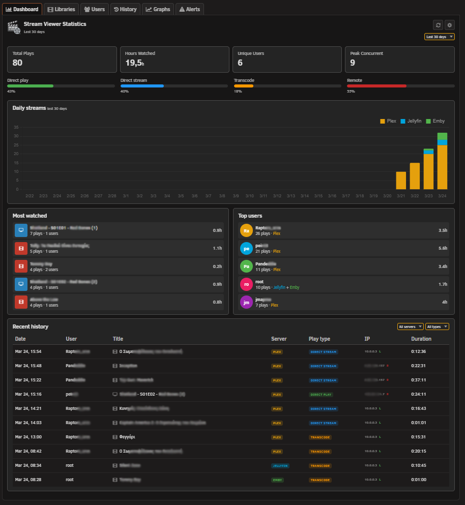
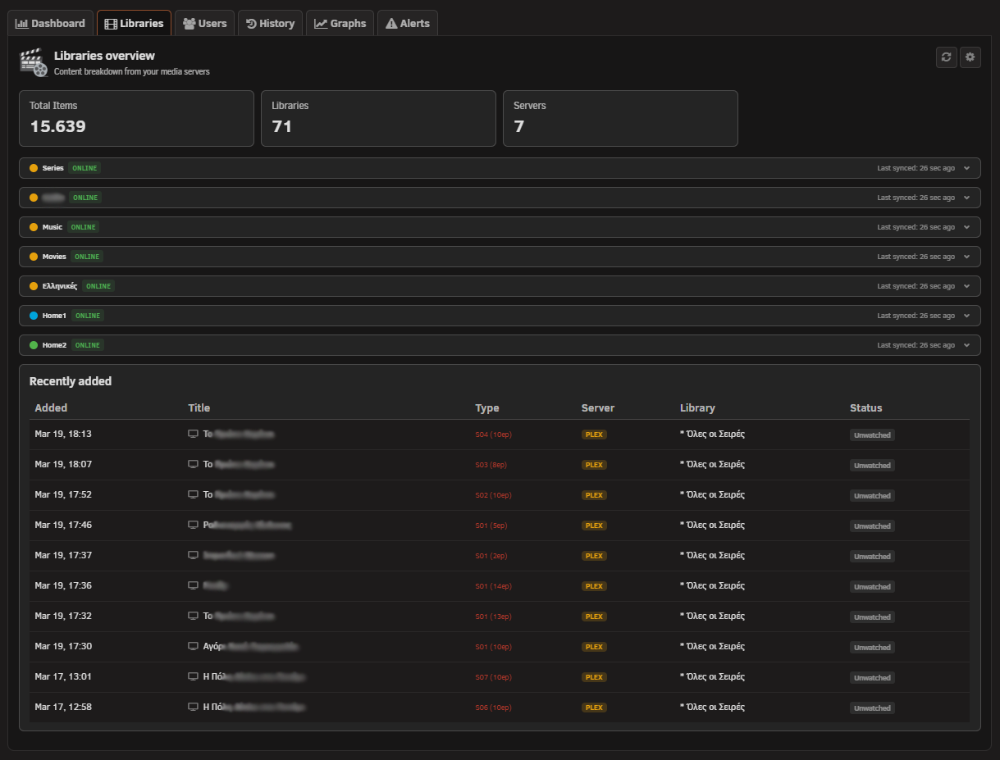
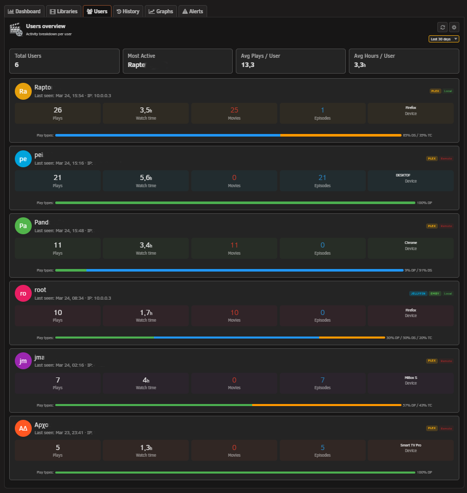
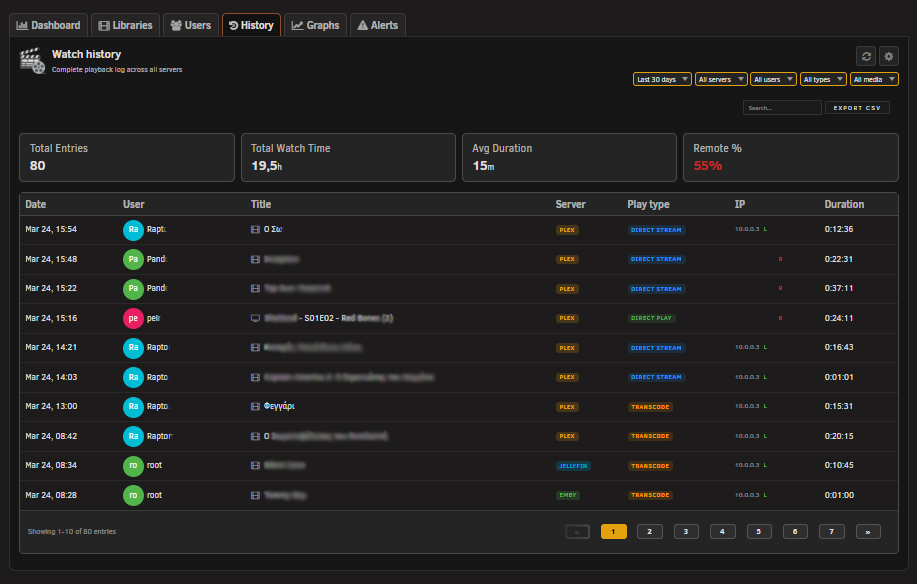
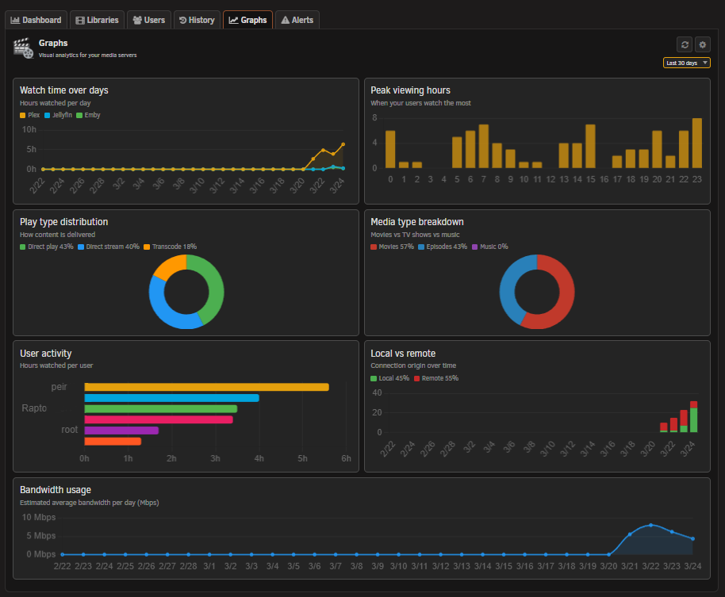
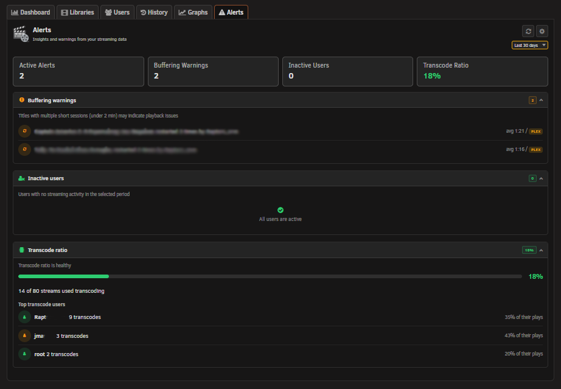

# Stream Viewer for Unraid

A real time media stream monitor and statistics tracker for Unraid. View active streams from your Plex, Jellyfin and Emby servers directly from the dashboard, and track watch history, library content and user activity through a dedicated statistics page.

## Features

**Dashboard Widget**
- Monitor active streams in real-time from the Unraid dashboard
- Multi-server support for up to 10 Plex, Jellyfin and Emby servers simultaneously
- Stream details including user, device, IP address, playback progress, quality and codec info
- Collapsible technical details row per stream (codec, audio channels, container, subtitles, HW acceleration, transcode reasons)
- Transcode monitoring with visual indicators for Direct Play, Direct Stream and Transcode sessions
- Transcode speed badge on active transcodes
- Docker CPU and RAM usage per media server container
- Kill Session button to terminate active streams directly from the widget
- Server type filter (Plex, Jellyfin, Emby)
- Configurable auto-refresh with adjustable polling interval
- Mobile responsive layout

**Statistics Tool Page (Beta)**
- Dashboard tab with active streams overview, most watched titles, top users and recent history
- Libraries tab with server overview, collapsible sections and recently added items
- Users tab with per-user play counts, watch time, content breakdown and play type distribution
- History tab with full watch history, filters, search, pagination and CSV export
- Graphs tab with daily streams, watch time distribution and play type breakdown charts
- Alerts tab (placeholder for future alert rules)
- SQLite database with automatic schema migration system
- Configurable data retention and IP anonymization

**Server Integration**
- Plex OAuth for secure server setup without storing passwords
- Auto-rediscover for Plex servers after IP changes
- Test Connection per server in Settings

## Installation

**Via Community Applications (recommended)**
1. Open Community Applications in Unraid
2. Search for Stream Viewer
3. Click Install

**Manual Installation**
1. Go to Plugins in Unraid
2. Click Install Plugin
3. Paste the following URL:

```
https://raw.githubusercontent.com/Lazaros-Chalkidis/unraid-streamviewer/main/streamviewer.plg
```

## Configuration

After installation, go to Settings > Stream Viewer to configure the plugin. The settings page is organized into three sections.

**Widget Settings**

| Setting | Description |
| --- | --- |
| Max Streams | Limit the number of streams shown on the dashboard |
| Show Device | Show or hide the client device name |
| Show IP | Show or hide the viewer IP address |
| Show Progress | Show or hide the playback progress bar |
| Show Quality | Show or hide the stream quality badge |
| Show Transcode | Show or hide the transcode/direct play badge |
| Show Technical Details | Show or hide the collapsible details row |
| Technical Details Default | Start expanded or collapsed |
| Show Docker Stats | Show or hide CPU/RAM usage per container |
| Auto Refresh | Enable or disable automatic stream refresh |
| Refresh Interval | How often to poll for new stream data (seconds) |
| Allow Kill Session | Enable the ability to terminate active streams |

**Connections Servers**

| Setting | Description |
| --- | --- |
| Server URL | Address of your Plex, Jellyfin or Emby server |
| Server Token | API token for authentication |
| Server Name | Display name shown in the widget |
| Plex OAuth | Secure token retrieval for Plex servers |
| TLS Verification | Enable or disable SSL certificate checking |

**Statistics Settings**

| Setting | Description |
| --- | --- |
| Statistics | Enable or disable the statistics tool page |
| Database Path | Directory where the SQLite database is stored (must be under /mnt/user/) |
| Data Retention | How many days of watch history to keep (7 to 365 days) |
| Anonymize IP | Mask the last octet of IP addresses before storing |
| Library Sections | Default state (expanded or collapsed) for library server sections |

## Supported Servers

| Server | Sessions | Kill Session | OAuth Setup |
| --- | --- | --- | --- |
| Plex | Yes | Yes | Yes |
| Jellyfin | Yes | Yes | No |
| Emby | Yes | Yes | No |

## Security

- CSRF token (nonce) protection on all API requests with sliding expiration
- Rate limiting (120 requests per minute per IP)
- Origin validation blocks cross-origin requests
- Input validation and sanitization on all parameters
- Prepared statements for all SQLite queries (no string concatenation)
- LIKE wildcard escaping with explicit ESCAPE clause
- Docker container ID hex-only validation before API use
- Security headers on all API responses (X-Frame-Options, X-Content-Type-Options, CSP, X-XSS-Protection, Referrer-Policy)
- Image proxy with URL allowlist, only proxies thumbnails from configured servers
- MIME type validation on proxied images with 5 MB size cap
- Plex account token never stored, only per-server access tokens are saved
- Database file permissions restricted to owner only (0600)
- Cache directory created with restricted permissions (0700)
- Cache-Control: no-cache, must-revalidate header
- AJAX-only enforcement (X-Requested-With check)
- HTTP method restriction (GET/POST only)
- URL validation on outbound HTTP requests
- PHP 7 compatible (no PHP 8 only functions)

## Screenshots

**Dashboard Widget**


**Statistics Tool**








**Settings Page**


## Development

**Requirements**
- Unraid 7.2.0 or later
- Bash (for build script)

**Build**

```bash
# Release build
./build.sh

# Dev build
./build.sh "" dev

# Local build (embedded package, no internet required)
./build.sh "" "" local

# Release with letter suffix (e.g. 2026.03.13a)
./build.sh a
```

**Project Structure**

```
unraid-streamviewer/
├── source/
│   ├── css/
│   │   ├── widget.css
│   │   ├── settings.css
│   │   └── tool.css
│   ├── js/
│   │   ├── streamviewer.js
│   │   ├── streamviewer-tool.js
│   │   └── chart.min.js
│   ├── StreamViewer.page
│   ├── StreamViewerSettings.page
│   ├── StreamViewerTool.page
│   ├── streamviewer_api.php
│   ├── streamviewer.png
│   ├── avatar.png
│   └── README.md
├── screenshots/
│   └── pc/
├── build.sh
├── CHANGELOG.md
├── streamviewer.plg
├── streamviewer.xml
└── LICENSE
```

## Changelog

See [CHANGELOG.md](https://github.com/Lazaros-Chalkidis/unraid-streamviewer/blob/main/CHANGELOG.md) for version history.

## Issues and Support

To suggest features, report bugs or share feedback, open an issue on [GitHub](https://github.com/Lazaros-Chalkidis/unraid-streamviewer/issues) or post on the [Unraid Forum](https://forums.unraid.net/topic/197757-plugin-stream-viewer/).

## Author

Lazaros Chalkidis
[GitHub](https://github.com/Lazaros-Chalkidis)

## License

Copyright (C) 2026 Stream Viewer Unraid Plugin, Lazaros Chalkidis

Licensed under the GNU General Public License v3.0 or later (GPL-3.0-or-later).
See the LICENSE file for the full license text.
