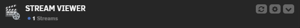
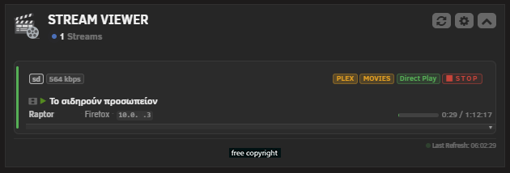
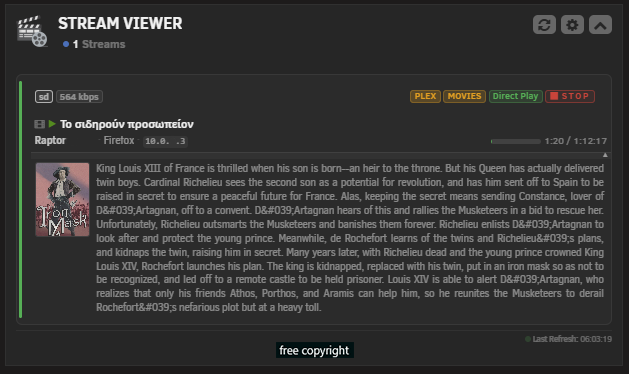
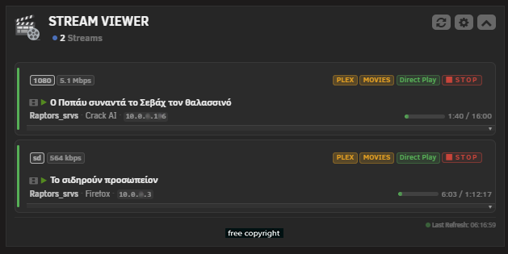
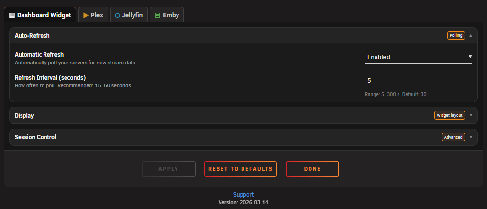
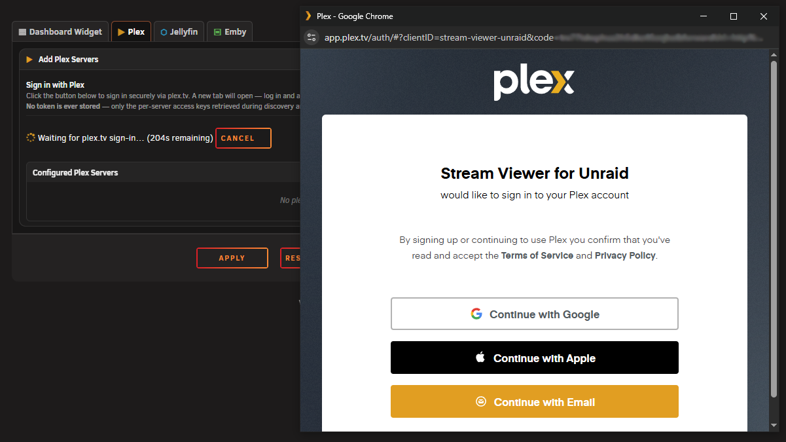
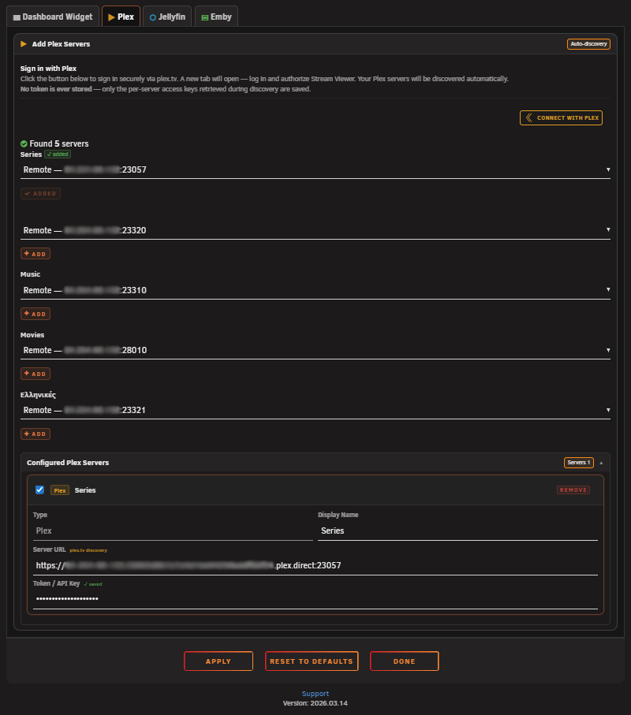
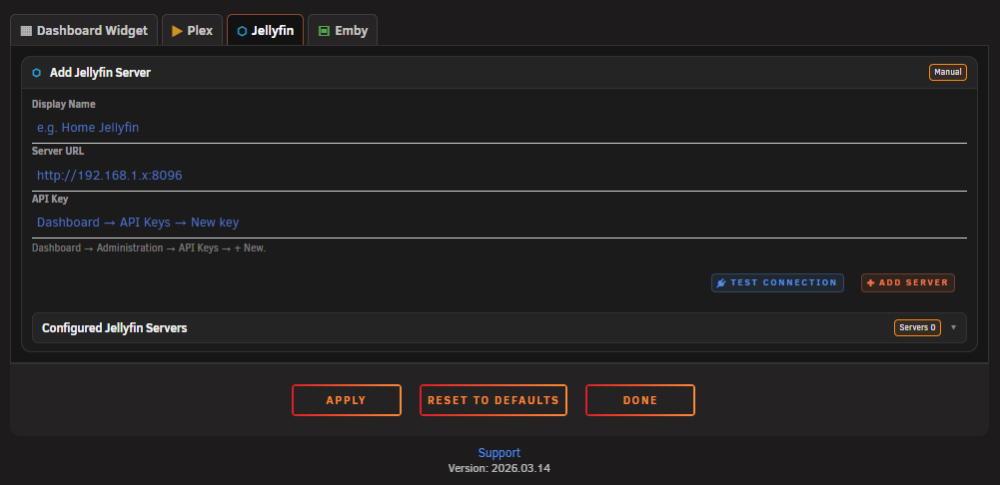

# Stream Viewer for Unraid

A modern and lightweight, real-time media stream monitor for Unraid. View active streams from your Plex, Jellyfin, and Emby servers directly from the dashboard.

---

## ✨ Features

- **Dashboard Widget**: Monitor active streams in real-time from the Unraid dashboard
- **Multi-Server Support**: Monitor up to 10 Plex, Jellyfin, and Emby servers simultaneously
- **Stream Details**: User, device, IP address, playback progress, quality and codec info per stream
- **Transcode Monitoring**: Visual indicators for Direct Play, Direct Stream, and Transcode sessions
- **Kill Session**: Terminate active streams directly from the UI (configurable)
- **Plex OAuth**: Secure Plex server setup via OAuth — no password ever stored
- **Auto-Rediscover**: Automatically recovers Plex server URLs after IP changes
- **Server Filter**: Filter streams by server type (Plex / Jellyfin / Emby)
- **Auto Refresh**: Configurable polling interval for live updates
- **Mobile Responsive**: Works on all screen sizes
- **Performance Friendly**: Micro-cache, backoff on errors, lightweight polling

---

## 📦 Installation

### Via Community Applications (recommended)
1. Open **Community Applications** in Unraid
2. Search for **Stream Viewer**
3. Click **Install**

### Manual Installation

1. Go to **Plugins** in Unraid
2. Click **Install Plugin**
3. Paste the following URL:
```
https://raw.githubusercontent.com/Lazaros-Chalkidis/unraid-streamviewer/main/streamviewer.plg
```

4. Click **Install**

---

## ⚙️ Configuration

After installation, go to **Settings → Stream Viewer** to configure:

The Dashboard Widget and the Tool Page have independent settings and can be configured separately to suit different use cases.

| Setting | Description |
| --- | --- |
| Servers | Add and configure Plex, Jellyfin, or Emby servers |
| Auto Refresh | Enable/disable automatic stream refresh |
| Refresh Interval | How often to poll for new stream data (in seconds) |
| Max Streams | Limit the number of streams shown |
| Show Device | Show or hide the client device name |
| Show IP | Show or hide the viewer IP address |
| Show Progress | Show or hide the playback progress bar |
| Show Quality | Show or hide the stream quality badge |
| Show Transcode | Show or hide the transcode/direct-play badge |
| Allow Kill Session | Enable the ability to terminate active streams |

---

## 🖥️ Supported Servers

| Server | Sessions | Kill Session | OAuth Setup |
| --- | --- | --- | --- |
| Plex | ✅ | ✅ | ✅ |
| Jellyfin | ✅ | ✅ | — |
| Emby | ✅ | ✅ | — |

---

## 🔒 Security

- CSRF token (nonce) protection on all API requests
- Rate limiting (120 requests/minute per IP)
- Origin validation — blocks cross-origin requests
- Input validation and sanitization on all parameters
- Security headers on all API responses (`X-Frame-Options`, `X-Content-Type-Options`, `CSP`, `X-XSS-Protection`)
- Image proxy with URL allowlist — only proxies thumbnails from configured servers
- Plex account token never stored — only per-server access tokens are saved
- Cache directory created with restricted permissions (`0700`)
- Referrer-Policy: same-origin header
- Cache-Control: no-cache, must-revalidate header
- AJAX-only enforcement (X-Requested-With check)
- HTTP method restriction (μόνο GET/POST)
- URL validation σε outbound HTTP requests (FILTER_VALIDATE_URL)
- MIME type validation σε proxied images

---

## 📸 Screenshots

### Dashboard Widget PC Screen





### Settings Page PC Screen





---

## 🛠️ Development

### Requirements

* Unraid 7.2.0 or later
* Bash (for build script)

### Build

```bash
# Release build
./build.sh

# Dev build
./build.sh "" dev

# Local build (embedded package, no internet required)
./build.sh "" "" local

# Release with letter suffix (e.g. 2026.03.13a)
./build.sh a
```

### Project Structure

```
unraid-streamviewer/
├── source/
│   ├── css/
│   │   ├── widget.css              # Dashboard widget & tool page styles
│   │   └── settings.css            # Settings page styles
│   ├── js/
│   │   └── streamviewer.js         # Frontend polling, rendering, UI logic
│   ├── StreamViewer.page           # Dashboard widget + tool page
│   ├── StreamViewerSettings.page   # Settings page
│   ├── streamviewer_api.php        # Backend API (sessions, kill, OAuth, discovery)
│   ├── streamviewer.png            # Plugin icon
│   ├── avatar.png                  # Widget avatar
│   └── README.md                   # In-plugin description
├── screenshots/
│   |── pc/                         # PC screenshots
├── build.sh                        # Build script
├── CHANGELOG.md                    # Version history
├── streamviewer.plg                # Plugin definition (generated by build.sh)
├── streamviewer.xml                # CA metadata
└── LICENSE
```

---

## 📋 Changelog

See [CHANGELOG.md](https://github.com/Lazaros-Chalkidis/unraid-streamviewer/blob/main/CHANGELOG.md) for version history.

---

## 🐛 Issues & Support

If you'd like to suggest new features, report a bug, or have any feedback, feel free to open an issue on
[GitHub](https://github.com/Lazaros-Chalkidis/unraid-streamviewer/issues)
or post on the
[Unraid Forum](https://forums.unraid.net/topic/).

---

## 👤 Author

**Lazaros Chalkidis**
- GitHub: [@Lazaros-Chalkidis](https://github.com/Lazaros-Chalkidis)

---

## 📄 License

Copyright (C) 2026 Stream Viewer Unraid Plugin — Lazaros Chalkidis

Licensed under the GNU General Public License v3.0 or later (GPL-3.0-or-later).
See the `LICENSE` file for the full license text.
